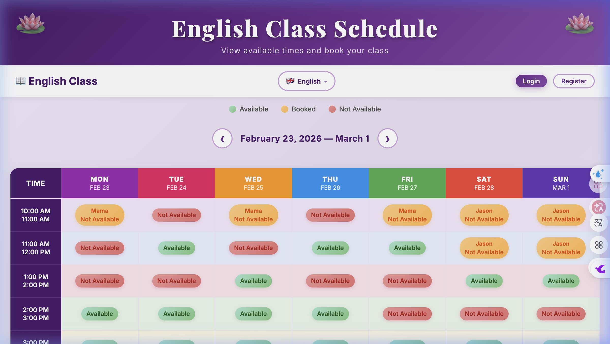
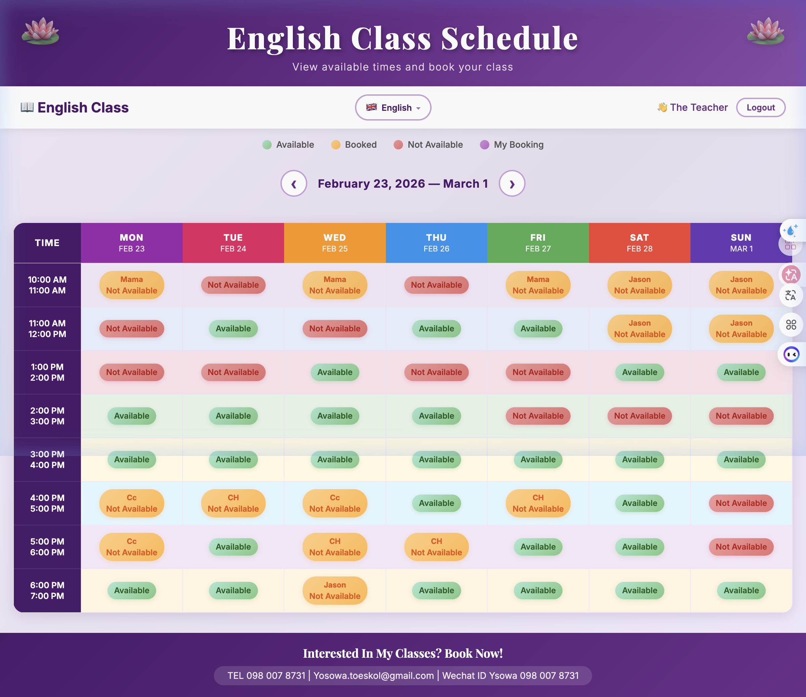
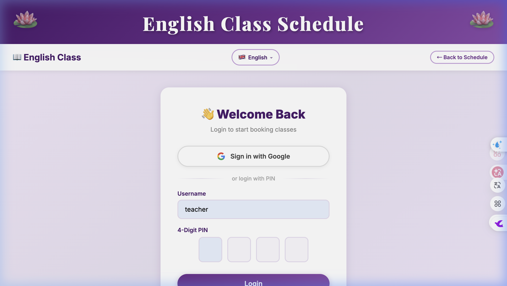
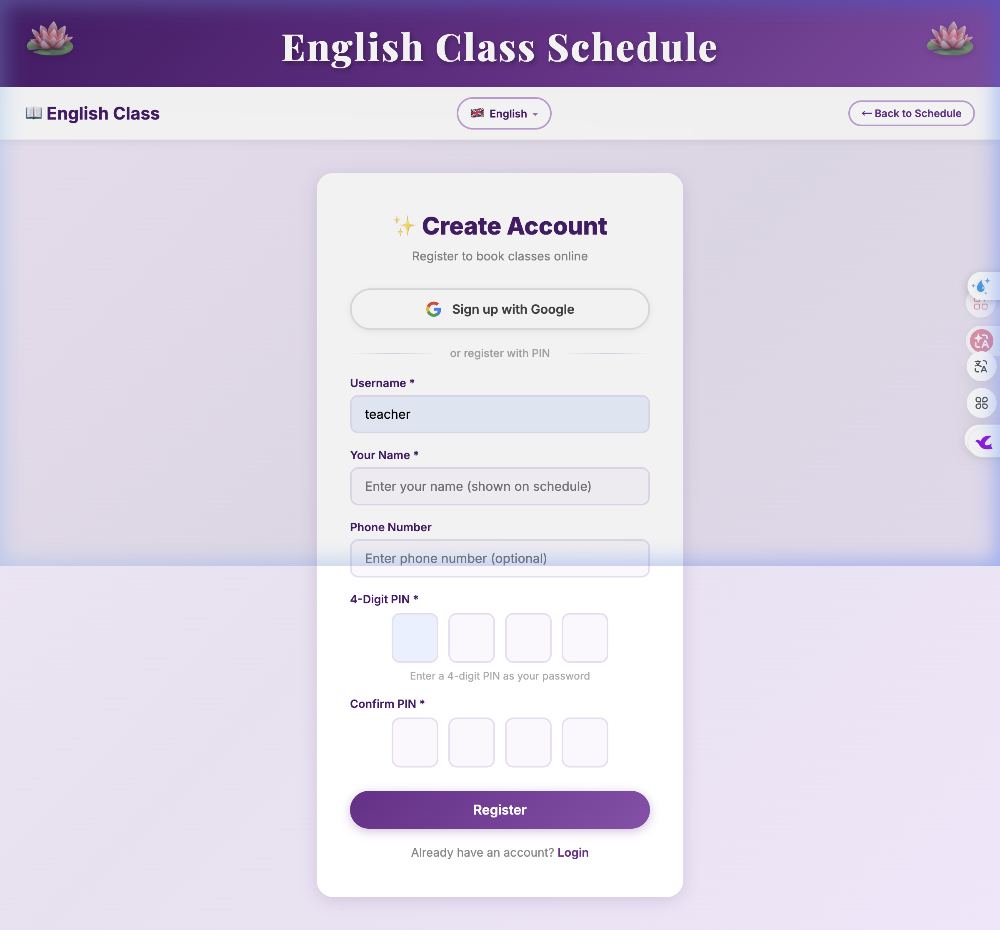

<div align="center">

# 🎓 English Class Booking System
# 英语课程预约系统

[](https://english-class-booking.onrender.com/)
[](https://nodejs.org/)
[](https://expressjs.com/)
[](LICENSE)

**A modern, multilingual class booking system for English tutoring.**
**一个现代化、多语言支持的英语课程预约系统。**

[🌐 Live Demo 在线演示](https://english-class-booking.onrender.com/) · [📖 Features 功能特性](#-features--功能特性) · [🚀 Quick Start 快速开始](#-quick-start--快速开始)

</div>

---

## 📸 Screenshots / 界面展示

<table>
  <tr>
    <td width="50%">
      
      <p align="center"><b>📅 Weekly Schedule / 每周课程表</b></p>
    </td>
    <td width="50%">
      
      <p align="center"><b>👩‍🏫 Teacher View / 教师视图</b></p>
    </td>
  </tr>
  <tr>
    <td width="50%">
      
      <p align="center"><b>🔐 Login with PIN / PIN码登录</b></p>
    </td>
    <td width="50%">
      
      <p align="center"><b>✨ Register / 创建账号</b></p>
    </td>
  </tr>
</table>

---

## ✨ Features / 功能特性

### 🗓️ Schedule Management / 课程表管理
| Feature | Description |
|---------|-------------|
| **Weekly Calendar View** / 每周日历视图 | Color-coded 7-day schedule with 8 time slots (10:00–19:00) / 彩色编码的7天课程表，8个时间段 |
| **Real-time Status** / 实时状态 | 🟢 Available 可约 · 🟡 Booked 已约 · 🔴 Not Available 不可约 |
| **Week Navigation** / 周导航 | Browse past and future weeks with date display / 浏览过去和未来的周次，显示具体日期 |

### 🔐 Authentication / 用户认证
| Feature | Description |
|---------|-------------|
| **4-Digit PIN** / 4位数字PIN码 | Simple and secure student login with 4-digit PIN / 简单安全的4位数字密码登录 |
| **Google OAuth** / Google第三方登录 | One-click registration & login via Google account / 一键 Google 账号注册登录 |
| **Session Management** / 会话管理 | Secure cookie-based sessions with 7-day expiry / 基于 Cookie 的安全会话，7天有效期 |

### 🌍 Internationalization (i18n) / 多语言支持
| Language | Status |
|----------|--------|
| 🇬🇧 English | ✅ Full Support |
| 🇨🇳 中文 (Chinese) | ✅ 完整支持 |
| 🇹🇭 ภาษาไทย (Thai) | ✅ รองรับเต็มรูปแบบ |
| 🇯🇵 日本語 (Japanese) | ✅ 完全サポート |

### �‍🏫 Teacher Admin / 教师后台
- **Manage Slots** — Set time slots as Available / Not Available / 设置时间段状态
- **View All Bookings** — See student names and booking details / 查看所有预约详情
- **Batch Operations** — Quickly update multiple time slots / 批量更新时间段

### 📲 Mobile Responsive / 移动端适配
- Fully responsive design for phones, tablets, and desktops / 完全响应式设计，适配手机、平板和桌面端
- Touch-friendly interface / 触控友好界面

---

## 🏗️ Tech Stack / 技术栈

```
┌─────────────────────────────────────────────────┐
│  Frontend / 前端                                 │
│  ├── HTML5 + Vanilla CSS + JavaScript           │
│  ├── Responsive Design (Mobile-first)           │
│  └── Client-side i18n (4 languages)             │
├─────────────────────────────────────────────────┤
│  Backend / 后端                                  │
│  ├── Node.js (≥18) + Express 4.x               │
│  ├── express-session (Cookie-based auth)        │
│  ├── bcryptjs (Password hashing)                │
│  └── google-auth-library (OAuth 2.0)            │
├─────────────────────────────────────────────────┤
│  Database / 数据库                               │
│  └── SQLite via sql.js (Zero-dependency)        │
├─────────────────────────────────────────────────┤
│  Deployment / 部署                               │
│  └── Render.com (Free tier, auto-deploy)        │
└─────────────────────────────────────────────────┘
```

---

## 📁 Project Structure / 项目结构

```
english-class-booking/
├── server.js              # Express server entry point / 服务器入口
├── database.js            # SQLite database & initialization / 数据库初始化
├── i18n-server.js         # Server-side internationalization / 服务端国际化
├── render.yaml            # Render.com deployment config / 云部署配置
├── package.json           # Dependencies & scripts / 依赖与脚本
│
├── public/                # Static frontend files / 前端静态文件
│   ├── index.html         # Main schedule page / 主课程表页面
│   ├── login.html         # Login page / 登录页
│   ├── register.html      # Registration page / 注册页
│   ├── admin.html         # Teacher admin dashboard / 教师管理后台
│   ├── calendar.html      # Calendar subscription page / 日历订阅页
│   ├── css/
│   │   └── style.css      # Global styles / 全局样式
│   └── js/
│       ├── i18n.js        # Client i18n engine / 客户端国际化引擎
│       ├── auth.js        # Auth logic (PIN + Google) / 认证逻辑
│       ├── schedule.js    # Schedule rendering / 课程表渲染
│       └── admin.js       # Admin panel logic / 管理后台逻辑
│
├── routes/                # API routes / API 路由
│   ├── auth.js            # /api/auth/* (register, login, Google OAuth)
│   ├── schedule.js        # /api/schedule/* (view & book classes)
│   ├── admin.js           # /api/admin/* (teacher management)
│   └── calendar.js        # /api/calendar/* (iCal subscription)
│
├── tests/                 # Test suite / 测试套件
│   └── test-suite.js      # 61 automated tests / 61个自动化测试
│
└── docs/
    └── screenshots/       # Documentation images / 文档截图
```

---

## 🚀 Quick Start / 快速开始

### Prerequisites / 前置条件
- **Node.js** ≥ 18.0.0
- **npm** (included with Node.js)

### Installation / 安装

```bash
# Clone the repository / 克隆仓库
git clone https://github.com/zixiang2008/english-class-booking.git
cd english-class-booking

# Install dependencies / 安装依赖
npm install

# Start the server / 启动服务器
npm start
```

### Access the Application / 访问应用

| URL | Description |
|-----|-------------|
| `http://localhost:3000` | 📖 Student view / 学生界面 |
| `http://localhost:3000/admin.html` | 🔧 Teacher admin / 教师管理后台 |

### Default Teacher Account / 默认教师账号

| Field | Value |
|-------|-------|
| Username / 用户名 | `teacher` |
| Password / 密码 | `teacher123` |

---

## ⚙️ Environment Variables / 环境变量

| Variable | Required | Description |
|----------|----------|-------------|
| `PORT` | No | Server port (default: `3000`) / 服务端口 |
| `NODE_ENV` | No | `production` for HTTPS cookies / 生产环境设置 |
| `SESSION_SECRET` | Yes (prod) | Session encryption key / 会话加密密钥 |
| `GOOGLE_CLIENT_ID` | No | Google OAuth Client ID / Google OAuth 客户端ID |
| `GOOGLE_CLIENT_SECRET` | No | Google OAuth Secret / Google OAuth 密钥 |
| `GOOGLE_REDIRECT_URI` | No | OAuth callback URL / OAuth 回调地址 |

---

## ☁️ Deploy to Render / 部署到 Render

This project includes a `render.yaml` for one-click deployment:
本项目包含 `render.yaml` 配置文件，支持一键部署：

1. Fork this repository on GitHub / Fork 本仓库
2. Go to [Render Dashboard](https://dashboard.render.com/) / 访问 Render 控制台
3. Click **New** → **Blueprint** → Select your forked repo / 选择 Fork 的仓库
4. Render will auto-detect `render.yaml` and deploy / Render 将自动检测配置并部署

> **Note / 注意:** Free tier services spin down after 15 minutes of inactivity. The first request may take 30-60 seconds.
> 免费计划的服务在闲置15分钟后会休眠，首次访问可能需要30-60秒。

---

## 🧪 Testing / 测试

```bash
# Run all 61 tests / 运行全部61个测试
npm test
```

---

## 📄 API Endpoints / API 接口

### Auth / 认证
| Method | Endpoint | Description |
|--------|----------|-------------|
| `POST` | `/api/auth/register` | Register new student / 注册新学生 |
| `POST` | `/api/auth/login` | Login with username & PIN / 用户名+PIN登录 |
| `POST` | `/api/auth/logout` | Logout / 退出登录 |
| `GET` | `/api/auth/me` | Get current user / 获取当前用户信息 |
| `GET` | `/api/auth/google` | Start Google OAuth / 发起 Google 登录 |
| `GET` | `/api/auth/google/callback` | Google OAuth callback / Google 回调 |

### Schedule / 课程表
| Method | Endpoint | Description |
|--------|----------|-------------|
| `GET` | `/api/schedule` | Get weekly schedule / 获取周课程表 |
| `POST` | `/api/schedule/book` | Book a time slot / 预约时间段 |

### Admin / 管理
| Method | Endpoint | Description |
|--------|----------|-------------|
| `GET` | `/api/admin/schedule` | Get full schedule (teacher) / 获取完整课程表 |
| `POST` | `/api/admin/schedule/update` | Update slot status / 更新时间段状态 |

---

## 📜 License / 许可证

This project is licensed under the **MIT License**.
本项目采用 **MIT** 开源许可证。

---

<div align="center">

**Made with ❤️ for English Education**
**为英语教育而生 ❤️**

[⬆ Back to Top / 返回顶部](#-english-class-booking-system)

</div>
